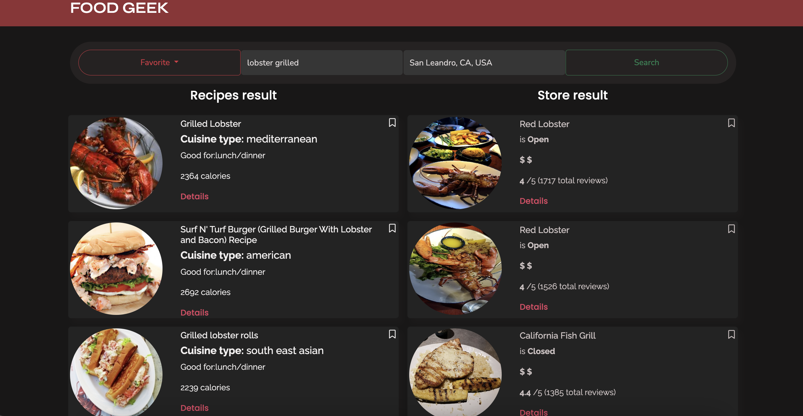
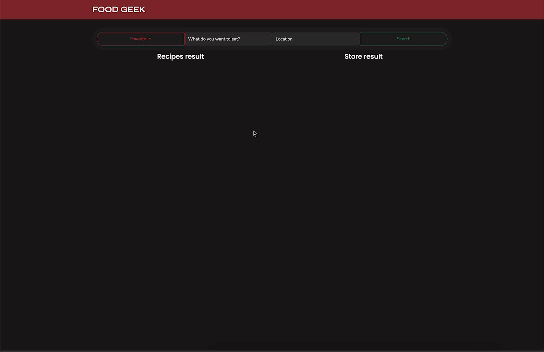
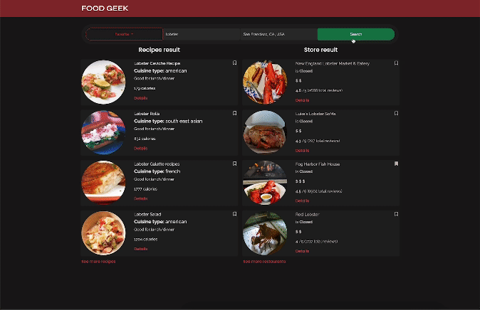
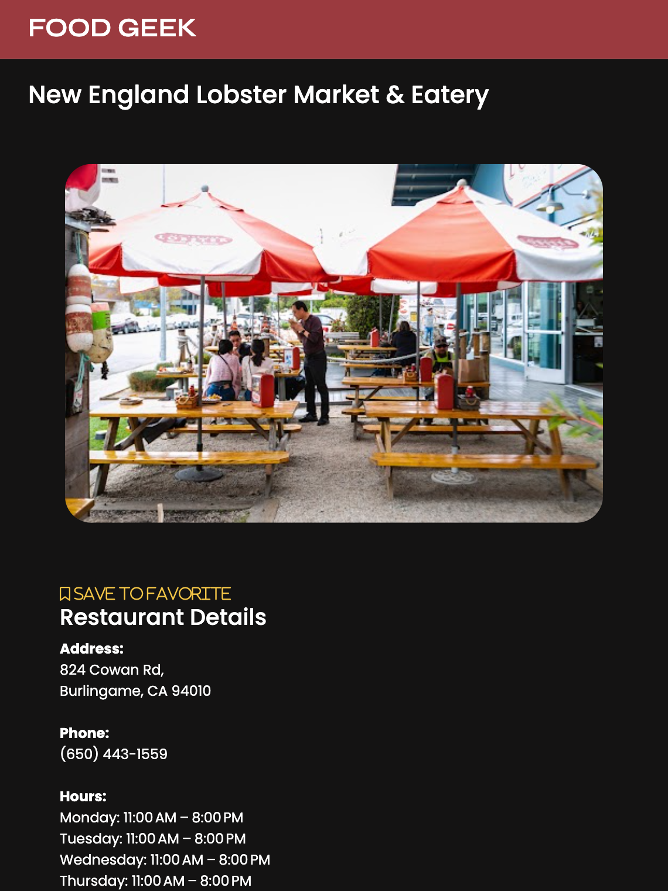
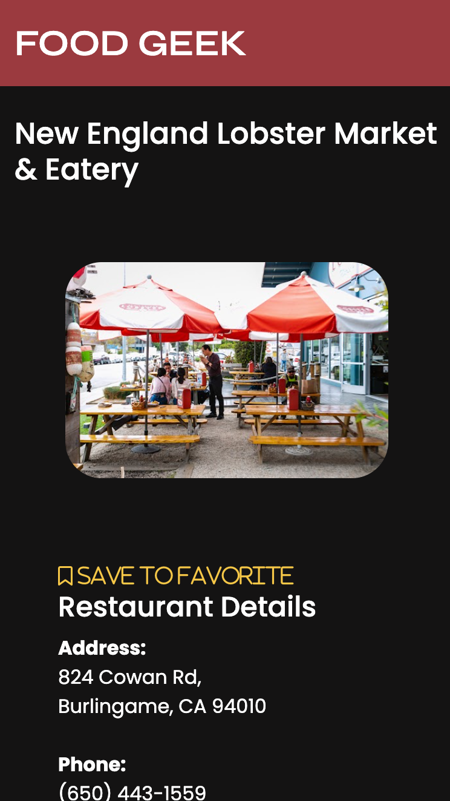

# Food Geek 


## Table of Contents
- [Description](#description)
- [Demo](#demo)
- [testing](#testing)
- [Features highlight](#features-highlight)

#### Web Application
[link to deploy Application](https://truecoding4life.github.io/food-geek/)


## Description

This website takes a search query from the user and will find restaurants and recipes related to it. This can help make it easier for users to decide whether they want to eat out or make their favorite dish at home.

We wanted to use 2 different server-side APIs, Google Maps/Places API and Edamam API. Google Maps would be used to search for local restaurants and provide autocomplete when searching for locations. Edamam provides recipes and their details such as the ingredients, calorie count, and the link to the original location of the recipe.

The user can bookmark their favorite recipes/restaurants and look at them in the bookmarks menu. Clicking on the bookmark link from the menu will move to the "details" page for that respective recipe/restaurant. The bookmarks are stored in the browser's local storage.


## Demo

**Website Home Page:** 

at the homepage user will be able to views all the results and the search bar.



<br>

**Searching for food:** 

For the app to work you must enter the food you want to search and a location where you want to look for. Google auto-fill is implemented to help make the process faster




**Look for restaurant reviews:**

User can find restaurant info and reviews

 


**Support different devices:**

We support arrange of different devices this help make our app more accessible.






## Testing

* Search function for many different locations. 
* Search function for many different food recipes.
* Website opening on loading/closing the site.
* Location storage to bookmark recipes/restaurants

## Learning Objectives

Some of the things we wanted to achieve through this project:

* Getting a deeper understanding of API calls and how to handle them
* Dynamically creating elements using the response from API calls
* Learn about different CSS frameworks outside of Bootstrap
* Getting a better understanding of how the git workflow functions with multiple users and resolving issues that arise
* Developing skills in communicating with others on a collaborative project, rather than using the driver/navigator role exclusively

## Features highlight

A function that returns a negative value if the given item id does not exist in bookmarks. This was crucial in making bookmarks function properly when adding or removing: <br>
```js
function filterBookmarks(itemId){
    for(var x = 0; x < bookmarks.length; x++) {
        if(bookmarks[x].id === itemId){
            return x;
        }
    }
    return -1;
}
```
<br><br>Uses the Google API nearbySearch in order to fill in the autocomplete dynamically based on the user's location: <br>

```js
// Use nearbySearch to get results from the user's keyword(s)
gPlaces.nearbySearch(request, function(results, status) {
    if (status !== google.maps.places.PlacesServiceStatus.OK) {
        console.error("couldn't get locations");
        return
    }

    let searchOptions = {
        keyword: keyword,
        city: queryLocation.val(),
        radius: searchRadius,
    }

    let updatedResults = updateResults(results);
    displayResults(updatedResults, searchOptions);
    updatedResults.push(searchOptions); // Add searchInfo to the end to use later

    // Store results in local storage to bring to see-more-restaurants.html
    let stringifyResults = JSON.stringify(updatedResults);
    localStorage.setItem(SEARCH_RESULTS, stringifyResults);
});
```

<br><br>On each of the seeDetails pages we called a function based on the given URL that contained the unique Id of each recipe/restaurant:
```js
var queryResult;
function getSearchQuery() {
    queryResult = document.location.search.split("=")[1];
    if (queryResult) {
        getSearchResults(queryResult);
    } else {
        // If no result, go back to main page
        document.location.replace("./index.html");
    }
};
```
## Credits

[Fresh food image](https://www.freepik.com/free-vector/restaurant-mural-wallpaper_10373272.htm#query=food%20graphic&position=4&from_view=keyword&track=ais)

## Technologies Used

|Technology Name|Resource|
|-----------|------------|
||[link](https://www.w3schools.com/js/js_intro.asp)|
||[link](https://www.w3schools.com/css/css_intro.asp)| |
||[link](https://www.w3schools.com/git/git_intro.asp?remote=github)||
||[link](https://jquery.com/)|
||[link](https://getbootstrap.com/docs/5.3/getting-started/introduction/)||
||[link](https://developers.google.com/maps/documentation/javascript/places#place_details)||
|**Edamam API**|[link](https://developer.edamam.com/edamam-docs-recipe-api)|

#### More Details

[Browser Geolocation](https://www.w3schools.com/html/html5_geolocation.asp)

[Full height background colo](https://stackoverflow.com/a/10115544)


### Google API

[Google Autocomplete](https://www.youtube.com/watch?v=c3MjU9E9buQ)

[Place Details](https://developers.google.com/maps/documentation/javascript/places#place_details)

[Place Data Fields](https://developers.google.com/maps/documentation/javascript/place-data-fields)

[Place Types](https://developers.google.com/maps/documentation/javascript/supported_types)

[Place Search requests](https://developers.google.com/maps/documentation/javascript/places#place_search_requests)


## Contributors
**Alonso Ampuero**
- [Github](https://github.com/FenriRagni)
- [LinkedIn](https://www.linkedin.com/in/alonsoampuero/)

**Minami Mukai** 
- [Github](https://github.com/mitsukaichi)
- [LinkedIn](https://www.linkedin.com/in/minami-itsukaichi/)

**Nathan Geronimo** 
- [Github](https://github.com/nathangero)
- [LinkedIn](https://www.linkedin.com/in/nathan-geronimo/)

## Author

**Jay Nghiem**

- [Portfolio](https://jstudio.tech)
- [LinkedIn](https://www.linkedin.com/in/thai-nghiem-319292267/)
- [GitHub](https://github.com/Truecoding4life)

## License

This project is licensed with MIT license

Link to License - [Website to MIT License](<(https://opensource.org/license/mit)>)